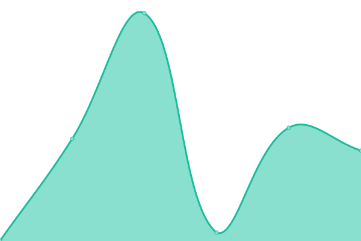

# [📈 Live Status](https://djidjya.github.io/chatbos-uptime): <!--live status--> **🟩 All systems operational**

This repository contains the open-source uptime monitor and status page for [SIA Djidjya](https://djidjya.github.io/chatbos-uptime), powered by [Upptime](https://github.com/upptime/upptime).

With [Upptime](https://upptime.js.org), you can get your own unlimited and free uptime monitor and status page, powered entirely by a GitHub repository. We use [Issues](https://github.com/djidjya/chatbos-uptime/issues) as incident reports, [Actions](https://github.com/djidjya/chatbos-uptime/actions) as uptime monitors, and [Pages](https://djidjya.github.io/chatbos-uptime) for the status page.

<!--start: status pages-->
<!-- This summary is generated by Upptime (https://github.com/upptime/upptime) -->
<!-- Do not edit this manually, your changes will be overwritten -->
<!-- prettier-ignore -->
| URL | Status | History | Response Time | Uptime |
| --- | ------ | ------- | ------------- | ------ |
|  [Platform Prod](https://chatbos.ai) | 🟩 Up | [platform-prod.yml](https://github.com/djidjya/chatbos-uptime/commits/HEAD/history/platform-prod.yml) | 

 69ms
     
 | 

<a href="https://djidjya.github.io/chatbos-uptime/history/platform-prod">100.00%</a>
    

|  [Chat Prod](https://chat.chatbos.ai/embed.iife.js) | 🟩 Up | [chat-prod.yml](https://github.com/djidjya/chatbos-uptime/commits/HEAD/history/chat-prod.yml) | 

 56ms
     
 | 

<a href="https://djidjya.github.io/chatbos-uptime/history/chat-prod">100.00%</a>
    

|  [API Prod](https://api.chatbos.ai/api/bots/59d23179-cbaf-4d07-8683-29d3965759cf) | 🟩 Up | [api-prod.yml](https://github.com/djidjya/chatbos-uptime/commits/HEAD/history/api-prod.yml) | 

 77ms
     
 | 

<a href="https://djidjya.github.io/chatbos-uptime/history/api-prod">100.00%</a>
    

|  [Platform Dev](https://platform.dev.chatbos.ai) | 🟩 Up | [platform-dev.yml](https://github.com/djidjya/chatbos-uptime/commits/HEAD/history/platform-dev.yml) | 

 59ms
     
 | 

<a href="https://djidjya.github.io/chatbos-uptime/history/platform-dev">100.00%</a>
    

|  [Chat Dev](https://chat.dev.chatbos.ai/embed.iife.js) | 🟩 Up | [chat-dev.yml](https://github.com/djidjya/chatbos-uptime/commits/HEAD/history/chat-dev.yml) | 

 61ms
     
 | 

<a href="https://djidjya.github.io/chatbos-uptime/history/chat-dev">100.00%</a>
    

|  [API Dev](https://api.dev.chatbos.ai/api/bots/4b02cb6c-f315-4443-8a82-cf629584a316) | 🟩 Up | [api-dev.yml](https://github.com/djidjya/chatbos-uptime/commits/HEAD/history/api-dev.yml) | 

 82ms
     
 | 

<a href="https://djidjya.github.io/chatbos-uptime/history/api-dev">100.00%</a>
    

<!--end: status pages-->

[**Visit our status website →**](https://djidjya.github.io/chatbos-uptime)

## 📄 License

- Powered by: [Upptime](https://github.com/upptime/upptime)
- Code: [MIT](./LICENSE) © [Anand Chowdhary](https://anandchowdhary.com), supported by [Pabio](https://pabio.com)
- Data in the `./history` directory: [Open Database License](https://opendatacommons.org/licenses/odbl/1-0/)
